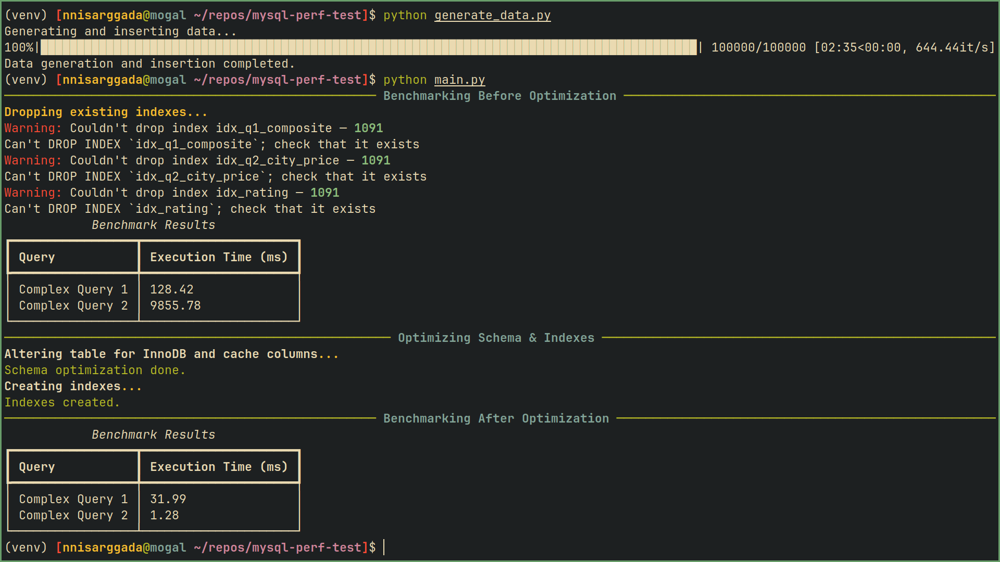

# MySQL Performance Optimization with Django

This project demonstrates practical MySQL performance optimization strategies implemented through a single Django management command, using a large synthetic dataset and complex queries. It covers techniques to improve query execution time, data integrity, and overall efficiency in transactional environments.

---

## Getting Started

### Prerequisites

* Python 3.8+
* Django (tested with Django 4.x)
* MySQL 8.0+
* Required Python packages (`mysql-connector-python`, `rich`)

### Setup

1. Install dependencies:

   ```bash
   python -m venv .venv
   source .venv/bin/activate
   pip install -r requirements.txt
   ```

2. Configure your MySQL database in Django’s `settings.py`:

   ```python
   DATABASES = {
       'default': {
           'ENGINE': 'django.db.backends.mysql',
           'NAME': 'test_performance',
           'USER': 'root',
           'PASSWORD': 'root',
           'HOST': 'localhost',
           'PORT': '3306',
       }
   }
   ```

3. Add your app containing the management command to `INSTALLED_APPS`.

---

## Usage

Generate synthetic data with:

```bash
python manage.py generate_data
```

Run the full benchmarking and optimization workflow with:

```bash
python manage.py full_benchmark
```

This command will:

* Drop existing indexes
* Run complex benchmark queries and measure execution time
* Alter the table schema (add generated columns, change storage engine)
* Create recommended indexes
* Run benchmarks again to compare before-and-after performance

The output will be nicely formatted with the `rich` library for easy interpretation.

---

## Optimization Strategies Implemented

### 1. Indexing

Indexes are essential for accelerating query execution by allowing the database engine to quickly locate rows that satisfy filter conditions.

* **Composite Indexes**: On multiple columns used together in `WHERE` clauses.
* **Single-Column Indexes**: On high-cardinality or frequently filtered/joined columns.
* **Functional Indexes**: On expressions like `ROUND(price, 0)` for queries using computed values.

**Impact**:
Significantly reduces query latency for filtering and ordering.

**Resources**:

* [MySQL 8.0 Indexes Documentation](https://dev.mysql.com/doc/refman/8.0/en/mysql-indexes.html)
* [Functional Indexes in MySQL 8.0](https://dev.mysql.com/doc/refman/8.0/en/create-index.html#create-index-functional)

---

### 2. Storage Engine: InnoDB

`InnoDB` was used for its robust transactional support, row-level locking, and crash recovery features.

**Impact**:

* Ensures data integrity and durability.
* Enhances performance under high concurrency.
* Supports foreign keys and transactions efficiently.

**Resources**:

* [InnoDB Storage Engine](https://dev.mysql.com/doc/refman/8.0/en/innodb-storage-engine.html)
* [Choosing a Storage Engine](https://dev.mysql.com/doc/refman/8.0/en/storage-engines.html)

---

### 3. Calculated Columns as Cache

A calculated column (`price_rating_cache`) is used to store derived categorical values based on `price` (e.g., 'premium', 'midrange', 'budget').

* Values are generated during data insertion.
* The column is indexed to speed up queries that filter or group by these categories.

**Impact**:

* Eliminates runtime computation overhead.
* Improves performance for derived-attribute queries.

**Resources**:

* [Generated Columns in MySQL](https://dev.mysql.com/doc/refman/8.0/en/create-table-generated-columns.html)
* [MySQL Generated Columns Guide](https://www.mysqltutorial.org/mysql-basics/mysql-generated-columns/)

---

### 4. Query Optimization

SQL queries were optimized through:

* **Column Pruning**: Avoiding `SELECT *`, selecting only required columns.
* **Index-Aware Querying**: Ensuring indexed columns are used in `WHERE` and `ORDER BY`.
* **Rewriting Subqueries**: Using joins or derived tables instead of nested subqueries.
* **Index-Assisted Aggregations**: Grouping and aggregating on indexed or cached columns.

**Impact**:

* Reduced CPU and I/O load per query.
* Lower temporary table and filesort usage.
* Enhanced overall throughput.

**Resources**:

* [MySQL Query Optimization](https://dev.mysql.com/doc/refman/8.0/en/where-optimization.html)
* [Index Optimization](https://dev.mysql.com/doc/refman/8.4/en/optimization-indexes.html)
* [EXPLAIN Statement Guide](https://dev.mysql.com/doc/refman/8.0/en/explain.html)

---

## Summary

| Optimization Strategy      | Purpose                           | Result                                  |
| -------------------------- | --------------------------------- | --------------------------------------- |
| Indexing                   | Speed up filters and sorts        | Dramatic reduction in query latency     |
| InnoDB Storage Engine      | Reliable, concurrent transactions | Improved data integrity and concurrency |
| Calculated Columns (Cache) | Avoid runtime computation         | Faster queries on derived attributes    |
| Query Optimization         | Efficient SQL construction        | Reduced resource usage per query        |

---

## Results



## Potential Disadvantages

While the strategies implemented significantly improve performance, some trade-offs should be noted:

* **Increased Storage Usage**: Indexes and generated columns consume additional disk space.
* **Write Performance Overhead**: `INSERT`, `UPDATE`, and `DELETE` operations may become slower due to index and cache maintenance.
* **Maintenance Complexity**: More intricate schema design requires careful upkeep.
* **Stale Cached Values**: If generated columns aren't refreshed correctly, data may become inconsistent.
* **Risk of Over-Indexing**: Too many indexes can degrade performance and require tuning.
